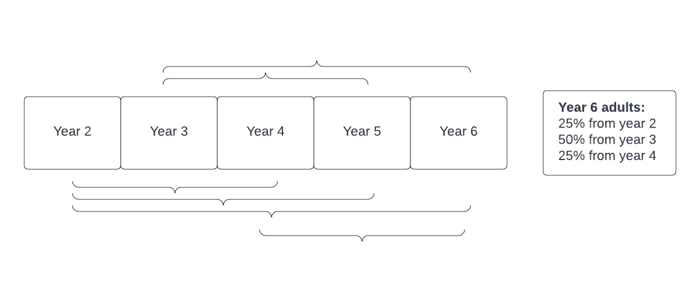
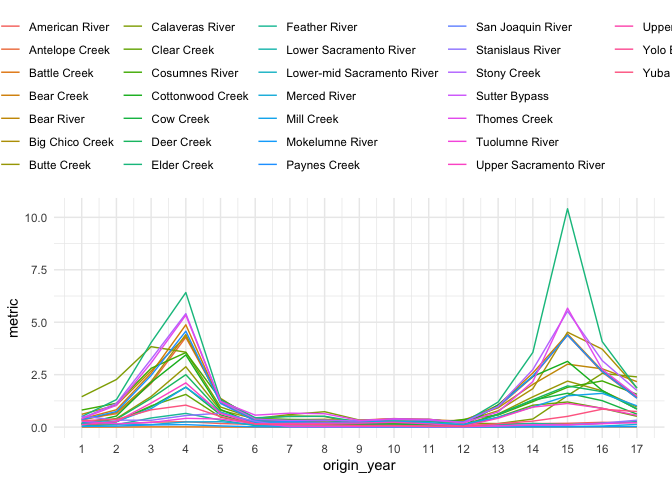
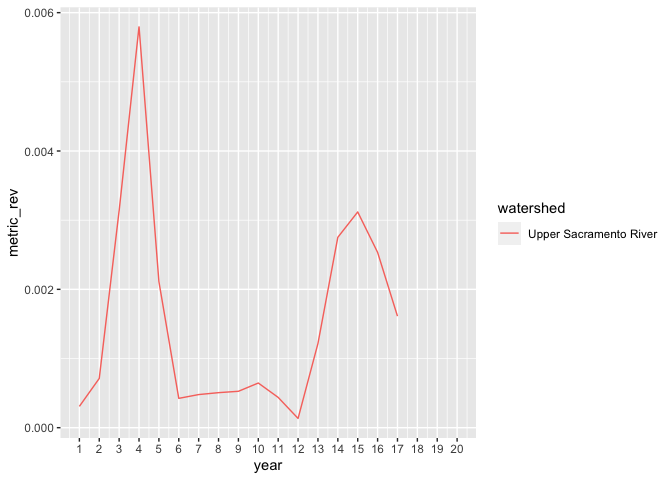

CRR Metric for R2R
================
Maddee Rubenson (FlowWest)
2022-11-09

### Run fallRunDSM model

``` r
s <- fall_run_model(mode = "seed")
sim <- fall_run_model(seeds = s, mode = "simulate")
```

## Adult Return Ratio

Adult return to natural origin/spawning adult ratio (mean) is defined
as: the number of natural origin adult returns in year X + 3 divided by
the number of in-river spawners in year X. This value represents the
proportion of natural spawners created by in river spawners from three
years prior.

Adults return over the course of three years with 25% returning in year
X + 2, 50% returning in year X + 3, and the final 25% returning in year
X + 4. For example, in year 6 adults are returning from years 2 (25%), 3
(50%), and 4 (25%). This should be considered when exploring the adult
return ratio because each year’s value is an aggregate of multiple years
of return salmonids.



``` r
natural_spawners <- (sim$proportion_natural * sim$spawners) |>
  as_tibble() |>
  mutate(watershed = fallRunDSM::watershed_labels) |>
  pivot_longer(names_to = "year", values_to = "natural_spawners", -watershed)

in_river_spawners <- sim$spawners |>
  as_tibble() |>
  mutate(watershed = fallRunDSM::watershed_labels) |>
  pivot_longer(names_to = "year", values_to = "total_spawners", -watershed)


sim_spawners <- in_river_spawners |>
  left_join(natural_spawners) |>
  group_by(watershed) |>
  mutate(
    year = as.numeric(year),
    lag_total = lag(total_spawners, 3),
    origin_year = lag(year, 3),
    metric = natural_spawners / lag_total) 

sim_spawners |>
  ggplot(aes(origin_year, metric)) +
  geom_line(aes(color = watershed)) +
  scale_x_continuous(breaks = 1:20) + 
  theme_minimal() + 
  theme(legend.position = "top") 
```

<!-- -->

``` r
# 20 year average across all watersheds
# percents 
sim_spawners |>
  group_by(watershed) |>
  summarise(
    mean_adult_return_to_origin = mean(metric, na.rm = TRUE) * 100,
    median_adult_return_to_origin = median(metric, na.rm = TRUE) * 100
  )
```

    ## # A tibble: 31 × 3
    ##    watershed       mean_adult_return_to_origin median_adult_return_to_origin
    ##    <chr>                                 <dbl>                         <dbl>
    ##  1 American River                       16.6                          15.2  
    ##  2 Antelope Creek                      133.                           63.7  
    ##  3 Battle Creek                          0.517                         0.384
    ##  4 Bear Creek                          142.                           82.6  
    ##  5 Bear River                          134.                           92.0  
    ##  6 Big Chico Creek                     140.                           69.6  
    ##  7 Butte Creek                          86.3                          53.5  
    ##  8 Calaveras River                     130.                           73.4  
    ##  9 Clear Creek                          51.2                          26.7  
    ## 10 Cosumnes River                      112.                           81.3  
    ## # … with 21 more rows

## Juveniles to Adult Ratio

The average juvenile to adult return ration is defined as the number of
juveniles produced in year X divided by the number of natural origin
adult returns in year X + 3. This ratio represents the percent of
returning natural origin adults that a cohort of juveniles produces. The
number of juveniles produced is assumed to be the value prior to
survival and migration factors applied.

``` r
juveniles <- sim$juveniles |> # TODO: what point in the model do we want to capture total juveniles?
  as_tibble() |>
  mutate(year = as.numeric(year)) |>
  group_by(year, watershed) |>
  summarise(total_juveniles = sum(juveniles)) |>
  ungroup() |>
  left_join(natural_spawners |>
              mutate(year = as.numeric(year))) |>
  arrange(watershed, year) |>
  group_by(watershed) |>
  mutate(natural_spawners_lag = lead(natural_spawners, 3),
         metric = total_juveniles / natural_spawners_lag,
         metric_rev = natural_spawners_lag / total_juveniles) |>
  ungroup()

juveniles |>
  group_by(watershed) |>
  summarise(avg_juvenile_metric_perc = mean(metric_rev, na.rm = TRUE) * 100) |>
  arrange(-avg_juvenile_metric_perc)
```

    ## # A tibble: 31 × 2
    ##    watershed        avg_juvenile_metric_perc
    ##    <chr>                               <dbl>
    ##  1 Elder Creek                         0.477
    ##  2 Stony Creek                         0.397
    ##  3 Thomes Creek                        0.382
    ##  4 Cottonwood Creek                    0.343
    ##  5 Bear Creek                          0.340
    ##  6 Big Chico Creek                     0.320
    ##  7 Calaveras River                     0.306
    ##  8 Paynes Creek                        0.306
    ##  9 Bear River                          0.304
    ## 10 Antelope Creek                      0.288
    ## # … with 21 more rows

``` r
juveniles |>
  filter(watershed == "Upper Sacramento River") |>
  ggplot(aes( year, metric_rev)) +
  geom_line(aes(color = watershed)) +
  scale_x_continuous(breaks = 1:20)
```

<!-- -->
